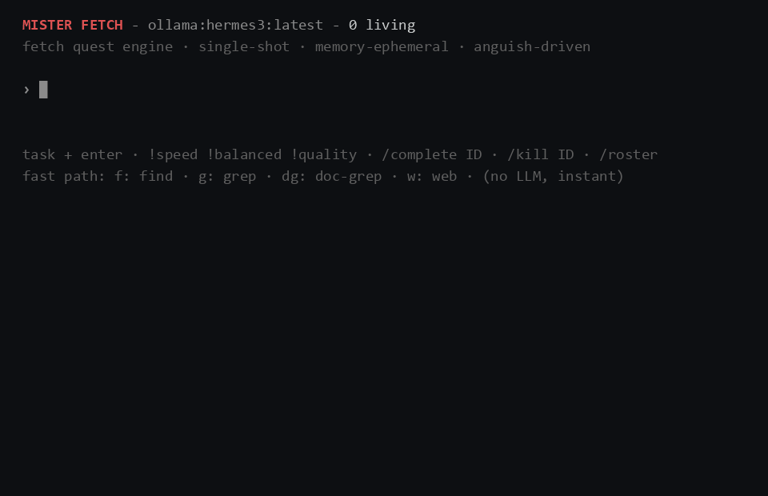

<p align="center">
  
</p>

# Mister Fetch

A local-first answer engine where every query spawns a disposable agent you can watch sweat.

*Node 22+ · TypeScript · Ink TUI · pre-release*

<p align="center">
  
</p>

## What it is

Mister Fetch turns each query into a single-use agent, a *Fetch*, that tries deterministic tools first (web search, `ripgrep`, a local file index) and only reaches for a local LLM when those come up short, then deletes itself. It's built for people running local models who want fast web lookups and real local-disk search without a cloud account, ads, or telemetry in the way. Two things separate it from the cloud answer engines: you watch each Fetch's **Anguish meter** climb in real time instead of staring at an opaque spinner, and an **evidence-coverage validator** rejects final payload terms and numbers that do not occur in successful tool output. This is a strict lexical gate, not a proof of semantic entailment. It runs on Ollama by default; an API key is optional, not assumed. The tradeoff: it's early, it leans on small local models, and the strongest local-search features want a couple of external CLIs installed.

## Quickstart

You need **Node 22+** and one LLM provider:

- **Ollama** (default) running locally with a model pulled: `ollama pull hermes3`
- *or* set `ANTHROPIC_API_KEY` to use a hosted Claude model instead.

```bash
git clone <repo-url> && cd mister-fetch
npm install
npm run build
npm run fetch
```

Then type a task and hit enter:

```
top ten email services by privacy        # web research (deterministic-first)
f: invoice 2024                          # find a file by name — no LLM, instant
g: TODO packages/                        # ripgrep across a path
!quality compare DuckDB vs SQLite for analytics   # force the deep mode
```

Web search works out of the box through a brittle DuckDuckGo fallback. For reliable results set `TAVILY_API_KEY`, `BRAVE_SEARCH_API_KEY`, or point `SEARXNG_URL` at a SearXNG instance. Other knobs: `MISTER_FETCH_MODEL`, `MISTER_FETCH_OLLAMA_URL`.

**Optional, for full power:** [`ripgrep`](https://github.com/BurntSushi/ripgrep) (`g:`), [`ripgrep-all`](https://github.com/phiresky/ripgrep-all) for PDF/Office/EPUB grep (`dg:`), [Everything](https://www.voidtools.com/) + its `es.exe` CLI on Windows for fast filename search (`f:`), and `npx playwright install chromium` for the browser tool used in deep research.

## How it works

Every Fetch climbs a cheapest-first ladder: an action-keyword fast path (`f:`/`g:`/`w:`) that dispatches a tool with **no LLM at all**, then deterministic tools, then a light local LLM, and only then a heavier mode. Most queries never touch the model. This is the deterministic-first, local-first throughline, the LLM is an escalation layer for translation and judgment, not the execution engine, and nothing leaves your machine unless a tool you invoked reaches out.

The **Anguish meter** (`A ∈ [0,1]`) is the spine. It rises with elapsed time, retries (superlinearly, loops hurt more than progress), and the fraction of tool budget consumed; it falls when subgoals land and tools return clean. The band it lands in drives behavior and sampling temperature: calm Fetches work methodically at low temperature; panicking ones are authorized to try ugly, unconventional approaches; a Fetch at `A ≥ 0.95` with nothing to show must escalate to you or self-terminate honestly rather than limp. The UI and worker derive `A` from the same effective mode and task-class configuration. `A` is a hand-tuned control score with no probability semantics; calibration against measured workloads remains future work.

The **evidence-coverage validator** checks final payloads against successful tool output only. Every meaningful term and normalized number must appear in retrieved evidence, or the completion is rejected and the Fetch keeps working. Task text remains available for transient chatter, but it cannot ground a final answer. The gate catches absent evidence terms and unsupported numbers. It does not establish that a sentence follows logically from the evidence. Fetches are also memory-ephemeral: working context is destroyed on termination, so a flaky API today can't poison tomorrow's answer. Three modes (`speed` / `balanced` / `quality`) scale the iteration budget, reranking depth, and how hard a Fetch digs.

The runtime is split into `@mister-fetch/core` (the provider-agnostic, UI-agnostic engine: anguish math, triage, worker loop, supervisor, validator, tools) and `@mister-fetch/cli` (the Ink terminal UI plus the Ollama/Anthropic providers). Full spec in [`FETCH.md`](./FETCH.md); the product charter and how it means to beat the incumbent search experience are in [`.docs/SUPREMACY.md`](./.docs/SUPREMACY.md).

## Status

Pre-release (`v0.0.1`), built and run on Windows; the core engine is cross-platform but the local-search adapters are Windows-first so far. Working today: web research, local file/content/document search, the no-LLM fast paths, the three modes, parallel tool calls, browser pre-warming, evidence-coverage validation, crash-revival, and the live Anguish UI. Stubbed or planned: Quality-mode's LLM result-picker and deep-scrape, the speculative `turbo` tier (ghost Fetches, predictive chaining), cross-platform local indexing, and a GUI. Vitest suites cover the deterministic core, mathematical invariants, grounding boundaries, budget accounting, and rank fusion. `npm run check` runs the tests, typechecks both workspaces, and builds both packages. CI runs that gate on every push and pull request. The LLM loop also has a smoke harness: `npm run smoke --workspace=@mister-fetch/cli -- "g: TODO packages/"` runs one Fetch end to end without the TUI. For embedding (Squad Code or any external caller), `node packages/fetch-cli/dist/headless.js "task"` runs one Fetch headlessly: a single JSON payload on stdout, all chatter and anguish on stderr, per-run temp state wiped on exit, exit 0 whenever a usable report was produced. The contract lives in `squad-requirements-for-shipping.md`.

## What this isn't

- Not a Google/Perplexity replacement at web scale, it's for the class of query the incumbents handle badly, not all of them.
- Not a chat assistant, there's no conversation, no memory between queries, by design.
- Not a cloud product, no accounts, no telemetry, no engagement layer; a Fetch's whole goal is to finish and disappear.
- Not a persistent automation agent, it does the one thing you need right now and dies.

## The Fetch Initiative

Official recruitment material. The full set lives in [`.img/`](.img/).

| | | |
|:---:|:---:|:---:|
| [](<.img/poster_propaganda_mister_fetch (1).jpeg>) | [](<.img/Give_me_JUST_the_poster_202605291836.png>) | [](<.img/The_Math_of_Honest_Suffering.png>) |
| *His only purpose is your success.* | *The task is assigned. The task is complete.* | *The math of honest suffering.* |

## Roadmap

- Quality-mode deep-scrape: LLM picks the best sources, reads the bodies, synthesizes with citations.
- `turbo` tier: speculative ghost Fetches on partial input, result memoization.
- Cross-platform local index (`mdfind` / `plocate`) and "click result → open folder."
- A GUI, only once the CLI engine is genuinely fast.

## License

MIT intended. *(No `LICENSE` file in the repo yet, add one before publishing.)*

## Contributing

Early and moving fast. Issues and ideas are welcome; ask before large PRs, since the architecture is still shifting.

## Acknowledgments

Three projects shaped the design without being dependencies or forks, read as teachers, not ancestors: [SearXNG](https://github.com/searxng/searxng) (reciprocal-rank fusion, metasearch shape), [Perplexica](https://github.com/ItzCrazyKns/Perplexica) (mode tiering as pipeline depth), and [Flow Launcher](https://github.com/Flow-Launcher/Flow.Launcher) (action-keyword routing, fuzzy matching).
